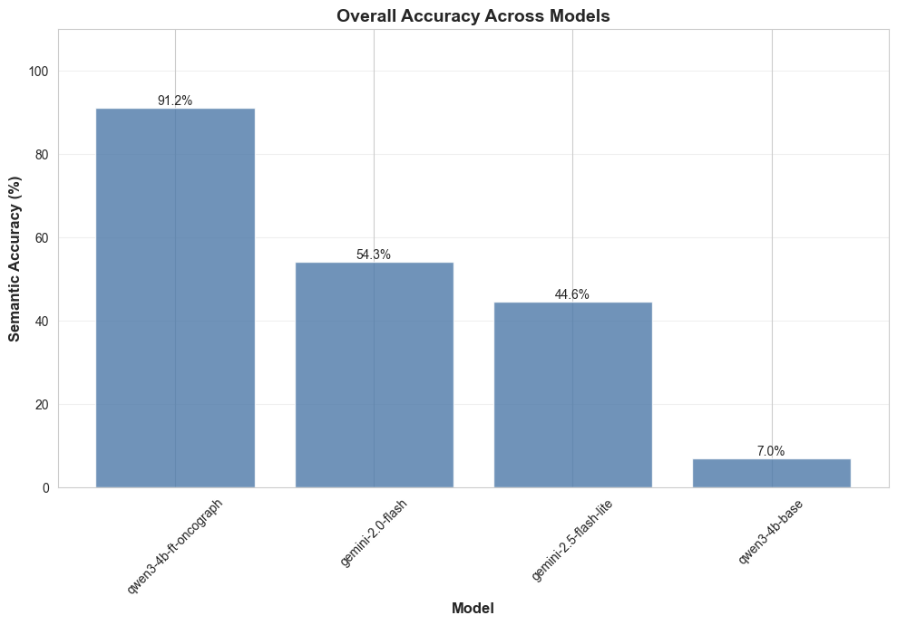

# Fine-Tuning Overview

High-level overview of OncoGraph fine-tuning project for text-to-Cypher generation.

---

## Problem

OncoGraph translates natural language questions about oncology data into Neo4j Cypher queries. The original system used a two-step LLM pipeline (Gemini) that had the following limitations:
- **Lack of schema/dataset-specific knowledge**
- **High latency:** Multiple API calls per query
- **High cost:** API usage per request
- **Limited domain specificity:** General-purpose model not optimized for Cypher generation

**Idea:** Accurate cypher generation requires a lot of schema-specific and dataset-specific knowledge. Giving it all via prompt engineering or RAG is not scalable or flexible. Instead, a small model can be fine-tuned to perform well on this specific schema.

---

## Solution

Fine-tuned an open source model (`Qwen3-4B-Instruct-2507`) on oncology-specific question-to-Cypher pairs to enable **single-step, direct text-to-Cypher generation**.

**Key Innovations:**
- **Deterministic ground truth:** All training Cypher queries generated by rule-based functions (not LLMs), ensuring correctness
- **Data augmentation:** Questions use disease synonyms and paraphrasing while Cypher always references canonical names, teaching synonym mapping
- **Comprehensive coverage:** Six query families (F1-F6) covering basic lookups to complex multi-hop reasoning

**Model:** `unsloth/Qwen3-4B-Instruct-2507` fine-tuned with LoRA (Low-Rank Adaptation)  
**Available on Hugging Face:**
- Merged 16-bit model: [`ib565/qwen3-4b-ft-oncograph-16bit`](https://huggingface.co/ib565/qwen3-4b-ft-oncograph-16bit)
- LoRA adapters: [`ib565/qwen3-4b-ft-oncograph-lora-adapters`](https://huggingface.co/ib565/qwen3-4b-ft-oncograph-lora-adapters)

**Deployment:** To be figured out. Looking for some budget friendly inference options.

---

## Results

| Model | Syntactic Validity | Execution Success | **Output Accuracy** | Avg Latency |
|-------|-------------------|-------------------|----------------------|-------------|
| **qwen3-4b-ft-oncograph** (fine-tuned) | **100%** | **100%** | **91.25%** | ~14.0s |
| Gemini 2.0 Flash (baseline) | 97.5% | 89.7% | 54.3% | ~14.6s |
| Gemini 2.5 Flash Lite (baseline) | 100% | 92.5% | 44.6% | **~6.4s** |
| qwen3-4b-base (untuned) | 88.8% | 60.6% | 7.0% | N/A |

Test set size: 80 queries; evaluation harness supports checkpointed resumption for larger runs.

**Evaluation depth:** Three-level validation (syntactic → execution → output accuracy) with manual error analysis for systematic improvements

**Performance Notes:**
- Fine-tuned model latency (~14s) is bottlenecked by free Colab T4 GPU; 16-bit merged model provides faster inference than LoRA adapters
- Potential optimizations: use vLLM for inference, use a faster GPU.

---

## Impact

- **2x improvement** in output accuracy over baseline models
- **~100% reliability** in generating valid, executable Cypher queries
- **Single-step generation** eliminates multi-call latency and API costs
- **Domain-specific expertise** trained on oncology data patterns

---

## Technical Details

For detailed information on dataset generation, training configuration, evaluation methodology, and key design decisions, see:
- **[FINETUNING_DETAILS.md](FINETUNING_DETAILS.md)** - Complete technical documentation

